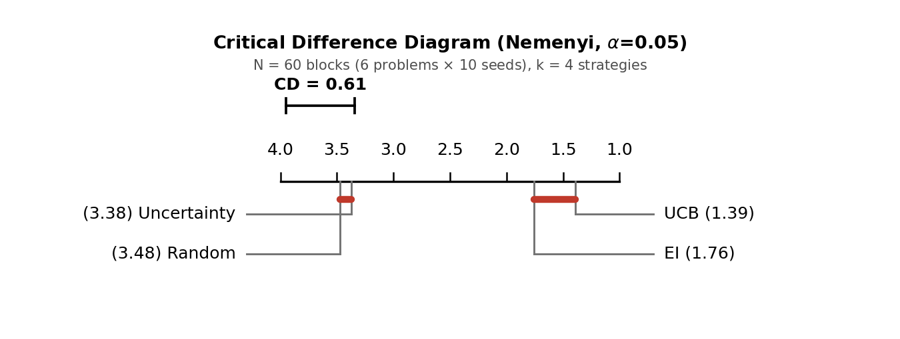

# Exploration or Numerics?

A pre-registered, optimiser-controlled study of greedy Bayesian optimisation and LogEI on De Ath's suite, built on a controlled benchmark of acquisition strategies.

**Report:** [`report/exploration_or_numerics.pdf`](report/exploration_or_numerics.pdf) (working paper, September 2026).

Author: Jianxiu Hou (jianxiuhou9@gmail.com).

## The question

Two influential results about Expected Improvement (EI), a central acquisition function in Bayesian optimisation, point in opposite directions. De Ath et al. (2021) show that near-greedy exploitation matches or beats EI on a synthetic suite and locate the difficulty in EI's explore–exploit decision rule. Ament et al. (2023) show that a numerically repaired EI, LogEI, improves on raw EI and locate the difficulty in EI's numerics instead. Whether De Ath's greedy-beats-EI result was partly an artefact of numerically broken EI had not been tested, because the two results sit on an axis that had never been crossed: De Ath optimised every acquisition with a gradient-free evolutionary optimiser (NSGA-II), while the field has largely standardised on gradient-based optimisation, under which alone the EI pathology has been analysed.

## What was done

**Part 1: reproduction and author-confirmed audit.** Every median-regret cell of De Ath's Table 2 is reproduced to three significant figures from his published runs (90/90 cells), and his pipeline is re-executed inside his Docker image (88 fresh runs on Branin and logGSobol). The audit found four text-versus-code discrepancies (F1, F2, F3, F5), which the author confirmed as real and limited in scope; none changes the best-median method on any problem. The audit notes are in [`literature/`](literature/).

**Part 2: a pre-registered optimiser-axis experiment.** The analysis plan (hypotheses, estimands, decision criteria and the mechanism-probe protocol) was frozen and git-tagged before any production data existed, with an append-only post-data amendment recording the analysis-script and data-archive hashes ([`docs/preregistration_phase3.md`](docs/preregistration_phase3.md)). The experiment adds five NSGA-II acquisition arms (EI, LogEI, UCB, Exploit, eps-PF) to a frozen gradient-based matrix, changing only the acquisition optimiser:

| Axis | Setting |
|---|---|
| Problems | De Ath's 10 synthetic problems plus Ackley-8, d = 1 to 10 |
| Arms | EI, LogEI, UCB (β = 2), Exploit (pure greedy, argmax μ), eps-PF (De Ath's eps-greedy over the (μ, σ) front) |
| Optimisers | gradient-based multi-start L-BFGS-B (BoTorch) versus NSGA-II at De Ath's settings (population 100d, 50 generations) |
| Budget | 250 evaluations, 30 seeds per cell, byte-identical initial designs across the paired optimisers |
| Size | 1650 NSGA-II cells paired against 2400 + 720 gradient-based cells; a 990-cell post-hoc matrix declared separately |

A mechanism probe records EI value-underflow and gradient-vanishing per cell, so that the two parts of the EI pathology can be separated operationally: a gradient-free optimiser is immune to vanishing gradients but not to regions where EI is exactly zero.

## Findings

- **Repairing EI's numerics does not help here.** LogEI beats neither raw EI nor De Ath's eps-greedy method, so the study finds no support for a broken-EI explanation of De Ath's result.
- **Pure greedy collapses to the worst arm overall**, yet under NSGA-II the best of the planned arms is an eps-greedy method. In high dimensions greedy beats EI and LogEI, but meets the per-problem criterion on only 2 of 4 problems: that reproduction fails, and the design principle that a little exploration suffices is supported descriptively, not by the planned test.
- **The EI gradient pathology is real and probe-confirmed but yields no performance advantage here**, and the two optimisers largely preserve the arm ordering.
- None of the three criteria fixed in advance came out positive; each resolved negative or at a boundary. On this suite the two published findings are compatible: what matters is that some exploration is present, not which acquisition supplies it.

## Contributions

1. Pre-registered boundary findings that, taken together, address the De Ath–Ament tension on this suite: a bounded null for the LogEI advantage, a corroboration of eps-greedy alongside a collapse of pure greedy, and a broad preservation of the arm ordering across optimisers.
2. An author-confirmed reproduction audit of De Ath et al. (2021) that grounds the negative results.
3. A pre-registration methodology, with the plan frozen and hashed before any production data, that lets negative results be read at face value.

## Earlier phase: a controlled benchmark of four acquisition strategies

The Part-2 experiment sits on top of a benchmark built first: four acquisition strategies (EI, UCB, pure-uncertainty, Sobol random) sharing an identical normalised Gaussian-process surrogate and BO loop, on six problems (d = 2 to 10, synthetic and engineering), 10 seeds each, 240 runs, evaluated with a Friedman + Nemenyi framework (N = 60 blocks). The 240 runs partition the strategies into two statistically separated classes, {EI, UCB} and {Uncertainty, Random}: selecting the point of maximum posterior standard deviation ranks indistinguishably from blind Sobol sampling, so exploitation of the posterior mean, not the uncertainty estimate alone, is the necessary ingredient. A secondary finding is that GP input normalisation to the known problem bounds is a first-class requirement on multi-scale engineering inputs; omitting it degraded BO to random-search performance on Piston (7D).



## Repository layout

```
src/al_benchmark/
  core/bo_loop.py        BO loop tying surrogate and strategy together; injectable initial designs
  surrogates/gp.py       normalised SingleTaskGP wrapper (fixed-bounds input normalisation)
  strategies/            EI, LogEI, UCB, Exploit, eps-RS, eps-PF, Uncertainty, Random, the NSGA-II
                         arms, and the post-hoc exact-front arm
  problems/              synthetic and engineering test functions; De Ath's suite (death.py)
  probe.py, mechanism_probe.py   EI value-underflow / gradient-vanishing probes
experiments/             numbered experiment scripts: exp_01–03 (the four-strategy benchmark),
                         exp_05–07 (Part-1 reproduction and Docker re-execution), exp_08–10 (gradient-based
                         matrices and their pre-registered analysis), exp_11 (NSGA-II matrix and
                         confirmatory analysis), exp_12 (post-hoc arms)
results/                 analysis summaries (JSON) behind every table and figure
figures/                 display figures from the four-strategy benchmark
report/                  exploration_or_numerics.pdf; phase3_paper/ holds the figure/table generator
                         (make_assets.py), the Part-1 verification script, and the generated assets
docs/                    pre-registration (with its append-only amendment), post-hoc protocol,
                         exact-front code audit, reading log
literature/              audit notes on De Ath's paper, supplement and code; Ament's protocol extraction
tests/                   regression tests (EI, eps-greedy, initial design, probe, LogEI–EI policy
                         equivalence, De Ath problem ports)
```

## Installation

Requires `conda` and Python 3.11.

```bash
conda env create -f environment.yml
conda activate al-benchmark
pip install -e .
pytest -q
```

Pinned dependencies are in `requirements.txt` (BoTorch 0.17.2, GPyTorch 1.15.2, pymoo 0.6.1).

## Reproducing

Four-strategy benchmark on one problem (10 seeds, 20 iterations), then the Friedman + Nemenyi analysis:

```bash
python experiments/exp_02_strategies_per_problem.py --problem Branin
python experiments/exp_03_friedman_nemenyi.py
```

NSGA-II matrix (1650 cells; about 43 hours on an Apple M3 laptop with two workers), gates, and the confirmatory analysis:

```bash
python experiments/run_exp11_nsga2.py --run --workers 2
python experiments/run_exp11_nsga2.py --summarize
python experiments/exp_11_analysis.py
```

Post-hoc arms and their analysis: `experiments/run_exp12_posthoc.py --run` then `experiments/exp_12_analysis.py`. Paper figures and table numbers: `python report/phase3_paper/make_assets.py`.

Notes:

- The raw per-cell run matrices (hundreds of megabytes) are not tracked; the analysis summaries under `results/*.json` are, and the content hashes of the frozen archives are recorded in the report and the pre-registration amendment. The raw matrices are available on request.
- The Part-1 reproduction scripts expect De Ath's released code (github.com/georgedeath/egreedy) checked out at `~/projects/egreedy` and, for the Docker re-execution, his published image.
- The released pre-registration is the frozen text except for the removal of one administrative line naming an intended publication outlet; hypotheses, criteria and analysis plan are verbatim.
